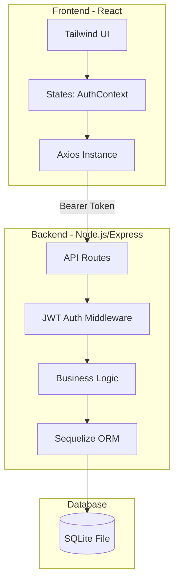
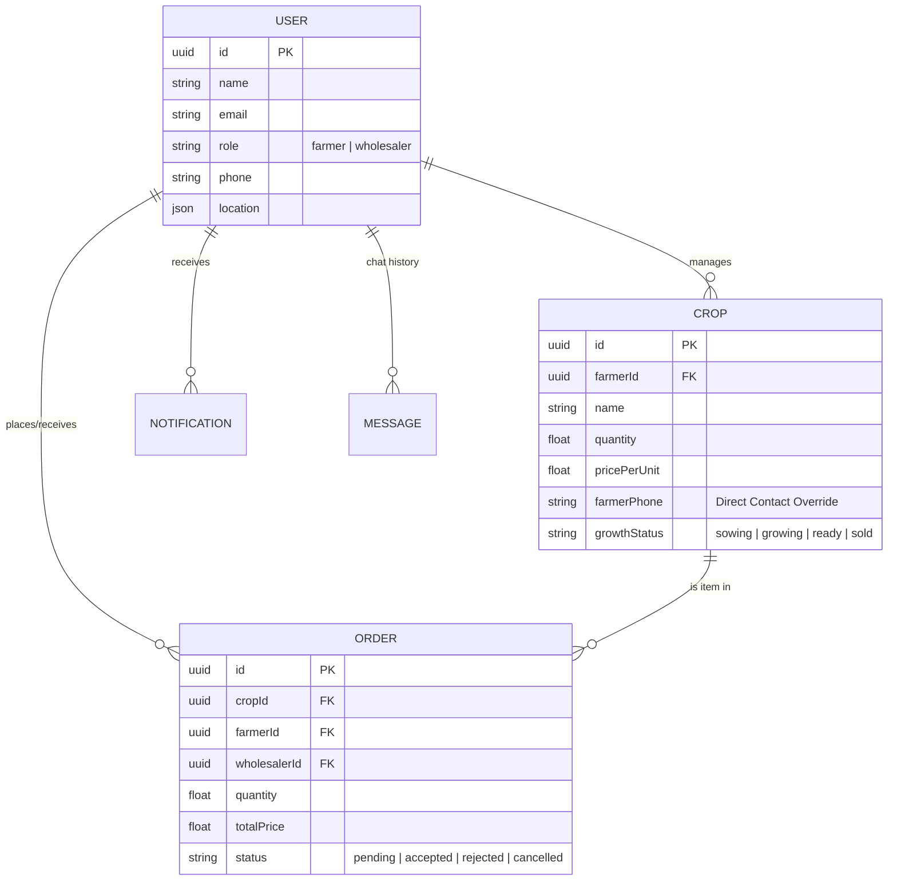
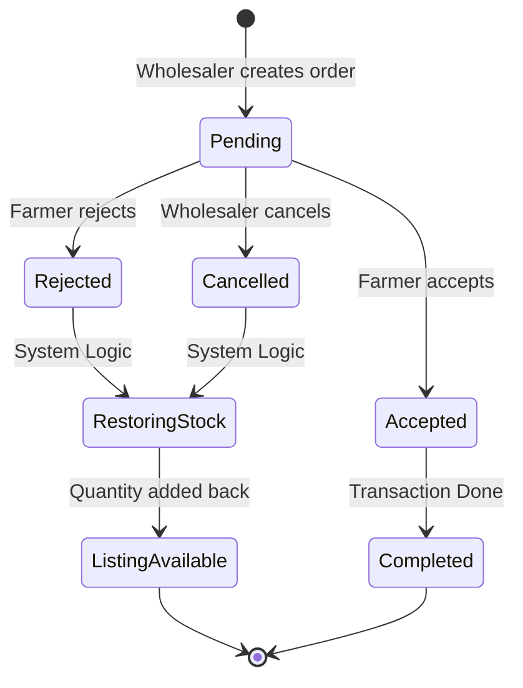
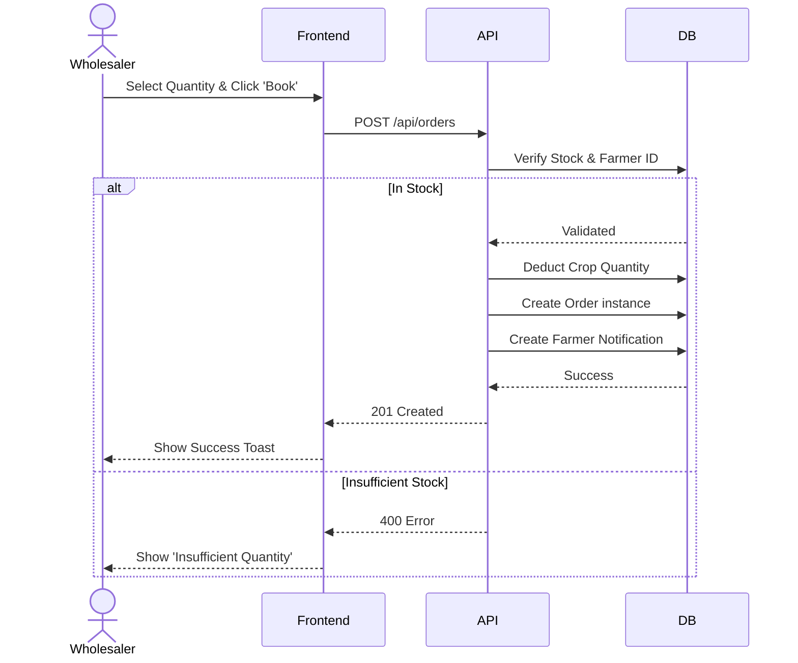

# AgroMedius - Technical Documentation

AgroMedius is a smart agricultural marketplace designed to connect farmers directly with wholesalers, eliminating middle-men and providing AI-driven insights.

## 1. System Architecture
AgroMedius uses a client-server architecture with a centralized database.

---

## 2. Entity Relationship Diagram (ERD)
The database structure focused on User roles, Crop listings, and Order management.

---

## 3. Order Lifecycle (State Machine)
Ensures inventory integrity. When an order is rejected/cancelled, quantity is automatically returned to the crop listing.

---

## 4. Sequence Diagram: Booking Process
Details the interaction between the user and the system during a purchase.

---

## 5. Key Use Cases
*   **Farmers:** List crops, set specific contact numbers per listing, manage booking requests, and message buyers.
*   **Wholesalers:** Browse Marketplace using filters (City, Category, Price), view AI suggestions, and book crops directly.
*   **System:** Automatically syncs profile data, handles database schema migrations, and sends real-time alerts.

---

## 6. Implementation Notes
*   **Security:** API routes are protected by a JWT-based middleware. Roles are enforced at the Route level.
*   **Database Migration:** The system uses a manual migration script in `db.js` to handle dynamic column additions (e.g., the recent `farmerPhone` addition).
*   **Accessibility:** The `farmerPhone` field defaults to the user's profile phone during crop creation to minimize data entry.
